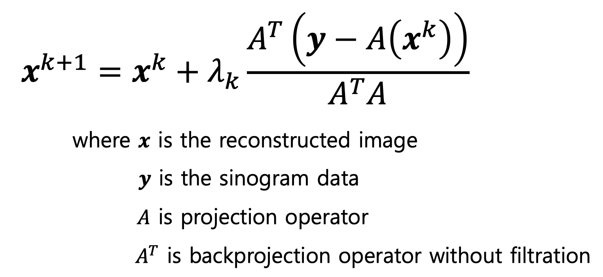
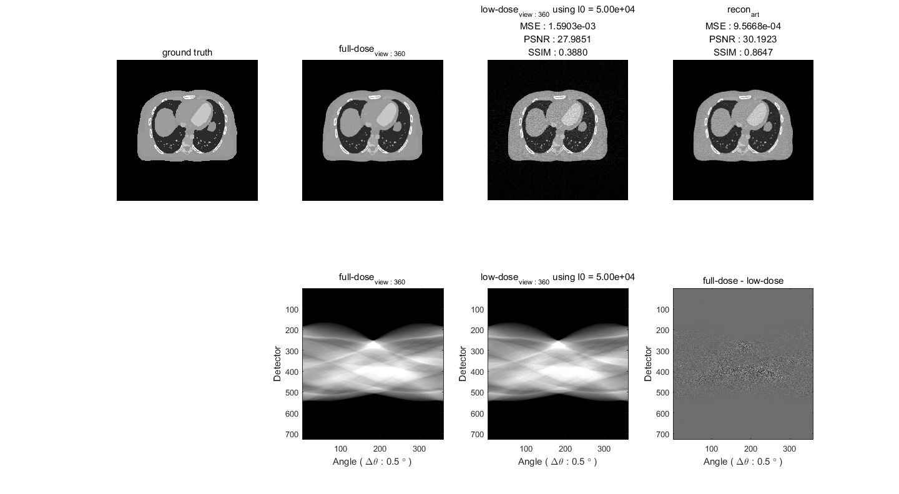

# ART

### Title
[Algebraic Reconstruction Technique (ART)](https://en.wikipedia.org/wiki/Algebraic_reconstruction_technique)

### Abstract
The **algebraic reconstruction technique (ART)** is an [iterative reconstruction](https://en.wikipedia.org/wiki/Iterative_reconstruction) technique used in [computed tomography](https://en.wikipedia.org/wiki/CT_scan). It reconstructs an image from a series of angular projections (a sinogram). Gordon, Bender and Herman first showed its use in image reconstruction; whereas the method is known as Kaczmarz method in numerical linear algebra.

An advantage of ART over other reconstruction methods (such as [filtered backprojection (FBP)](https://en.wikipedia.org/wiki/Radon_transform)) is that it is relatively easy to incorporate prior knowledge into the reconstruction process.

## Definition

## Results
